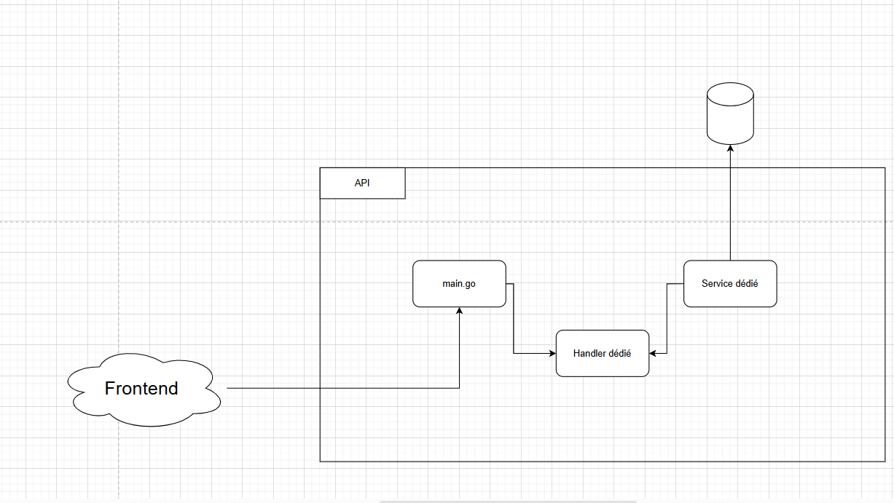

# Project Structure

## Diagram 

#### Entry point is main.go (all endpoints will be set there `r.POST("/adduser")`).
#### For each request we will write a struct to convert it in a usable Go Object (cf. ./Request/Readme.md)
#### Each endpoint will have its own Handler => Handler is the function that will handle the request
##### 1. Receive the request (with the *c.Context)
##### 2. Convert it in a Request object (c.ShouldBind). Check for error `if err := c.ShouldBind(...`
##### 3. If needed, check the data (check if the password has 8 caracters, check if the email is valid, etc...)
##### 4. Call the dedicated Service function, where all the business logic will take place (Call external API's, insert in the DB, ...)
