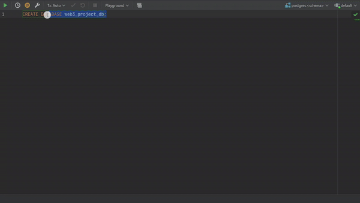

# Project Web 3

## Quel est notre technologie ?
### <b>Le Framework GIN</b>

## But de la l'application
Il s'agit d'une API Rest, développée en Go dans le framework GIN, pour un site de vente en ligne.

Pour configurer la base de donnée,
1. Changez le nom du fichier <i>/Database/db_variables.template.go</i> en <i>/Database/db_variables.go</i>
1. Remplissez les champs `username` et `password` dans le fichier db_variables (Vous pouvez changer d'autres champs également selon votre besoin (par exemple le nom de la base de donnée `DbName`))
1. Dans une query console de datagrip, éxecutez cette query 
```
CREATE DATABASE web3_project_db
```
4. Connectez vous à cette base de donnée
5. Collez le SQL que vous trouverez dans  le fichier backend/Database/script.sql
6. Executez le <br></br>


Pour lancer l'API, veuillez éxecuter cette commande dans le terminal
```
go run main.go
```
Nous avons programmé un frontend en React uniquement pour faire la démonstration

<br></br>
L'API est développée selon l'architecture en couches
## <u>L'architecture</u> 


<br></br>
1. Le point d'entrée est le main.go où les requêtes sont ont été paramétrées (voir tout les endpoinds ci-dessous), 
1. Le handler dédié sera appelé
1. S'il y a aucune erreur dans les donnée du body de la requête, le service correspondant sera invoqué
1. Le service intéragira avec la base de donnée et appliquera la logique métier pour répondre à la requête
1. Si aucune erreur n'est produite lors de l'intéraction avec la BD, le handler retournera la réponse du service en JSON


## <u>Endpoints</u>

Voici une liste des endpoints que notre API propose

|URI |Method |Params |Description |
|-|-|-|-|
|`/auth/signup`| `POST`|1. username (string)<br> 2. password (string) |Creates a user in the database
|`/auth/connect`|`POST`|1. username (string)<br> 2. password (string)    | Connects a user to the website |
|`/auth/user-role`|`GET`|/|Gets the user of the connected user|
|`/article/getall`| `GET`|/|Gets all the articles we have|
|`/article/get/:id`|`GET`|id (number)|Gets an article of the ID|
|`/article/add`|`POST`|1. name (string) <br> 2. description (string) <br> 3. imgurl (string) <br> 4. price (number)|Adds the article in the database (only for admin)|
|`/basket/add`|`POST`|1. articleId (number) <br> 3. quantity (number)|Adds an article (of the ID) to the user's basket|
|`/basket/delete-all`|`DELETE`|/|Deletes a basket (when a user finalises an order or removes the last article (<i>empty basket</i>))|
|`/basket/get`|`GET`|/|Gets the basket of the user |
|`/basket/increase-quantity`|`PUT`|1. articleId (number) <br> 2. quantity (number)|Increases the item quantity in the basket|
|`/basket/decrease-quantity`|`PUT`|1. articleId (number) <br> 2. quantity (number)|Decreases the item quantity in the basket|
|`/order/get-all`|`GET`| / |Gets all the orders of the user|
|`/order/get/:id`|`GET`|1. orderId (number) |Gets the order |
|`/order/finalize`|`POST`|/|Finalises the basket of a user|
</br>

## <u>Diagramme de la base de donnée</u>


<br></br>

#### Projet réalisé par Kevish GAWRI, Sébastien DEWILDE et Sungrab TENZIN
