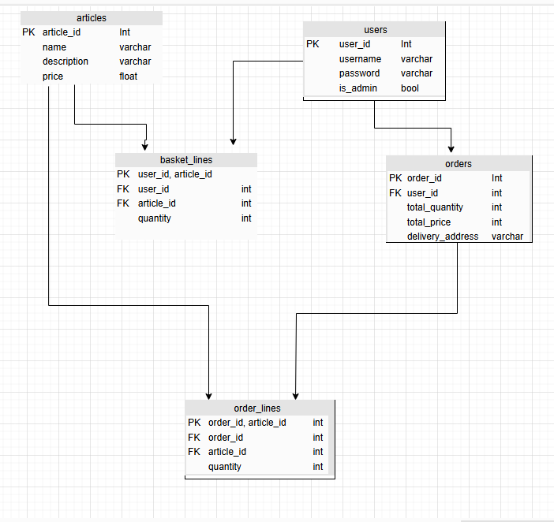

# Project Web 3

## But de la l'application
Il s'agit d'une API Rest, développée en Go dans le framework GIN, pour un site de vente en ligne.

Pour lancer l'API, veuillez éxecuter cette commande dans le terminal
```
go run main.go
```

<br></br>
L'API est développée selon l'architecture 
### <u>Diagramme de l'architecture</u> 


## <u>Endpoints</u>

Voici une liste des endpoints que notre API propose

|URI |Method |Params |Description |
|-|-|-|-|
|`/auth/signup`| `POST`|1. username (string)<br> 2. password (string) |Creates a user in the database
|`/auth/connect`|`POST`|1. username (string)<br> 2. password (string)    | Connects a user to the website |
|`/auth/user-role`|`GET`|/|Gets the user of the connected user|
|`/article/getall`| `GET`|/|Gets all the articles we have|
|`/article/get/:id`|`GET`|id (number)|Gets an article of the ID|
|`/article/add`|`POST`|1. name (string) <br> 2. description (string) <br> 3. imgurl (string) <br> 4. price (number)|Adds the article in the database (only for admin)|
|`/basket/add`|`POST`|1. articleId (number) <br> 3. quantity (number)|Adds an article (of the ID) to the user's basket|
|`/basket/delete-all`|`DELETE`|/|Deletes a basket (when a user finalises an order or removes the last article (<i>empty basket</i>))|
|`/basket/get`|`GET`|/|Gets the basket of the user |
|`/basket/increase-quantity`|`PUT`|1. articleId (number) <br> 2. quantity (number)|Increases the item quantity in the basket|
|`/basket/decrease-quantity`|`PUT`|1. articleId (number) <br> 2. quantity (number)|Decreases the item quantity in the basket|
|`/order/get-all`|`GET`|1. userId (number) |Gets all the orders of the user|
|`/order/get/:id`|`GET`|1. orderId (number) |Gets the order |
|`/order/finalize`|`POST`|1. userId (number)|Finalises the basket of a user|
</br>
## <u>Diagramme de la base de donnée</u>
