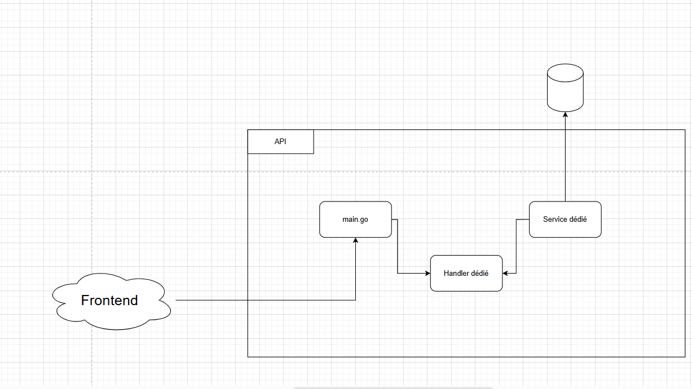
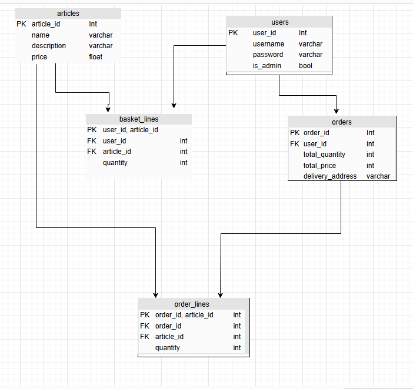

# Project Structure

## <u>Diagram</u> 

#### Entry point is main.go (all endpoints will be set there `r.POST("/adduser")`).
#### For each request we will write a struct to convert it in a usable Go Object (cf. ./Request/Readme.md)
#### Each endpoint will have its own Handler => Handler is the function that will handle the request
###### 1. Receive the request (with the *c.Context)
###### 2. Convert it in a Request object (c.ShouldBind). Check for error `if err := c.ShouldBind(...`
###### 3. If needed, check the data (check if the password has 8 caracters, check if the email is valid, etc...)
###### 4. Call the dedicated Service function, where all the business logic will take place (Call external API's, insert in the DB, ...)

## <u>Endpoints</u>

Here is a list of the endpoints with a description

|URI |Method |Params |Description |
|-|-|-|-|
|`/auth/signup`| `POST`|  username (string)  password (string) |Creates a user in the database
|`/auth/connect`|`POST`| username (string)  password (string)    | Connects a user to the website |
|`/user/get/:id`|`GET`|id (number)|Gets the information of a User|
|`/article/getall`| `GET`|/|Gets all the articles we have|
|`/article/get/:id`|`GET`|id (number)|Gets an article of the ID|
|`/basket/add`|`POST`|userId (number)   articleId (number)   quantity (number)|Adds an article (of the ID) to the user's basket|
|`/basket/delete-all`|`DELETE`|userId (number)|Deletes a basket (when a user finalises an order or removes the last article (<i>empty basket</i>))|
|`/article/remove`|`DELETE`|userId (number)   articleId (number)|Removes the article from the user's basket
|`/order/get-all`|`GET`|userId (number) |Gets all the orders of the user| 
|`/order/finalise`|`POST`|userId (number)|Finalises the basket of a user|
 
## <u>Database diagram</u>
